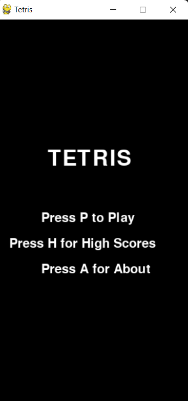

# Tetris Game

This is a classic Tetris game implemented in Python using Pygame. It includes features such as:

- Full implementation of the Tetris gameplay mechanics.
- Landed blocks are displayed in red.
- Scoring system where each cleared line scores 10 points.
- High scores are saved and displayed in an opening screen.
- Opening screen with options to Play, view High Scores, and About.

## Requirements

- Python 3.x
- Pygame library (`pip install pygame`)

## How to Play

1. **Clone the Repository**: Clone this repository to your local machine using Git.
   
   git clone https://github.com/your-username/tetris-game.git
   

2. **Navigate to the Directory**: Enter the directory containing the game files.
   
   cd tetris-game
   
2. **Run the Game**: Execute the `tetris.py` script using Python.
  
   python tetris.py
   
3. **Game Controls**:
   - **Left Arrow**: Move shape left
   - **Right Arrow**: Move shape right
   - **Down Arrow**: Move shape down (faster)
   - **Up Arrow**: Rotate shape clockwise
   - **P**: Start or restart game from opening screen
   - **H**: View High Scores from opening screen
   - **A**: View About information from opening screen
   - **Escape or X button**: Quit the game

4. **Objective**: Move and rotate falling shapes to create solid horizontal lines without gaps. Each completed line clears and scores points. The game ends when a new shape cannot be placed due to reaching the top of the screen.

## Customization

Feel free to customize the game further by modifying the code in `tetris.py`. You can adjust game speed, add new shapes, or change game mechanics as desired.

## Screenshots

## Credits

- Game implemented by Sajan Adhikari

## License

MIT License

